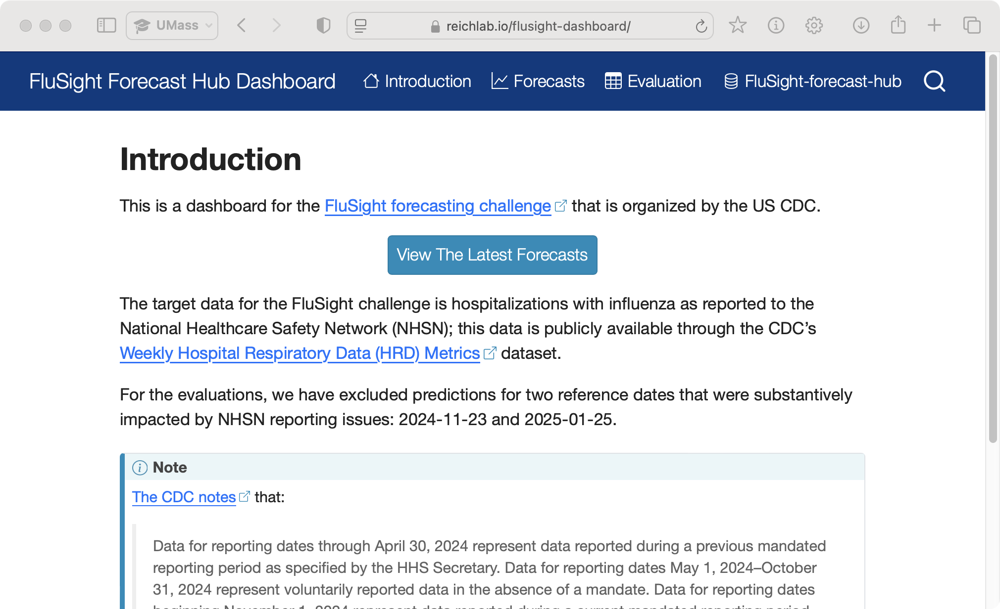
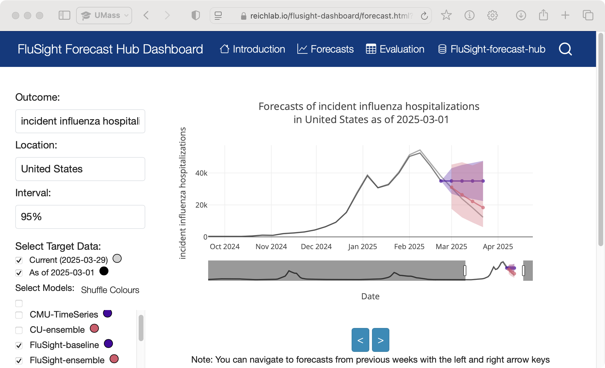
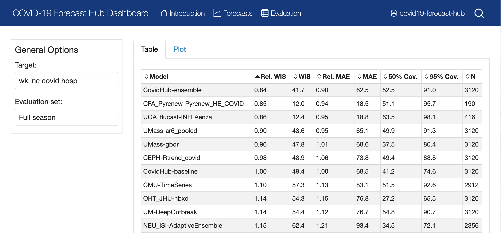
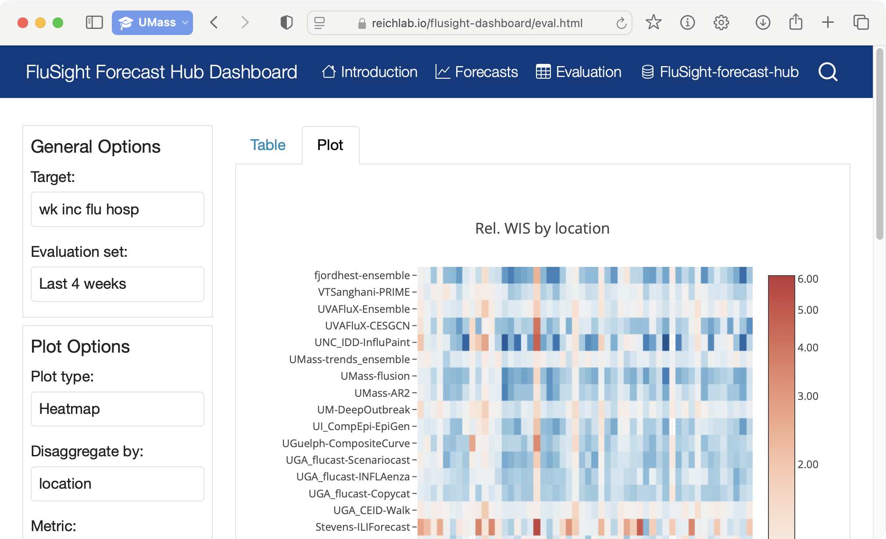

# Local Dashboard Workflow

One of the most daunting aspects of the dashboard workflows are the GitHub
workflows in [hubverse-org/hub-dashboard-control-room](https://github.com/hubverse-org/hub-dashboard-control-room).
However, the dashboard does not exclusively rely on the GitHub workflow and it
can be built locally. The diagram below shows how we get a dashboard website
(`site`) by using the pre-compute tools along with the dashboard and hub
repositories (note that `hub-dash-site-builder` is building the entire site,
not just `index.html`).

```{mermaid}
:name: local-workflow
:alt: A flowchart that demonstrates flow of data from the hub and dashboard to the final site with the tools that build each component labelling arrows.
:config: {"theme": "base", "themeVariables": {"primaryColor": "#dbeefb", "primaryBorderColor": "#3c88be"}}
flowchart BT
    hub["hub repository"]
    dashboard["dashboard repository"]
    ptc/data>ptc data]
    predevals/data>evals data]
    subgraph pre-compute toolchain
      hub-dashboard-predtimechart[\hub-dashboard-predtimechart/]
      hubPredEvalsData[\hubPredEvalsData/]
      hub-dash-site-builder[\hub-dash-site-builder/]
    end
    subgraph site
        index.html([index.html])
        forecast.html([forecast.html])
        eval.html([eval.html])
    end
    dashboard -->|site-config.yml| hub-dash-site-builder
    hub-dash-site-builder --> site
    hub -->|time-series data|hub-dashboard-predtimechart
    dashboard -->|predtimechart-config.yml|hub-dashboard-predtimechart
    hub-dashboard-predtimechart --> ptc/data
    hub -->|oracle data|hubPredEvalsData
    dashboard -->|predevals-config.yml|hubPredEvalsData
    hubPredEvalsData --> predevals/data
    predevals/data -.-> eval.html
    ptc/data -.-> forecast.html
```


## Purpose

This page will demonstrate that workflow using a practical example of building
[the flu metrocast dashboard](https://reichlab.io/metrocast-dashboard) locally.
The important takeaway from this exercise is that **you will understand the
bare minimum steps required to build a dashboard website** independent of
operational GitHub workflows[^operations]. Once you understand these steps, then
you will be able to think about how and when to deploy them.

At the end of this exercise, you will have the source for a website that you
can explore interactively on your local machine. All of the data are embedded
within the same folder as the website, so you can explore the data structures
and configuration files that power the visualizations.

[^operations]: Specifically, this tutorial is explicitly about _the build
    process_, which is one part of the overall operations for the dashboards.
    We will build an interactive dashboard website, but in this context, we are
    not concerned of _when_ the site or data are built nor are we concerned of
    _deployment_. These will be covered in a later chapter on deployment with
    GitHub workflows.

## Rationale

Building a dashboard website requires three tools:

1. <https://github.com/hubverse-org/hub-dash-site-builder> builds the static website
1. <https://github.com/hubverse-org/hub-dashboard-predtimechart> builds the predtimechart data and options file
1. <https://github.com/hubverse-org/hubPredEvalsData-docker> builds the predevals data and options file

These take data from two sources:

1. the dashboard repository (<https://github.com/reichlab/metrocast-dashboard>)
2. the hub repository (<https://github.com/reichlab/flu-metrocast>)

The GitHub workflows bind all of these together, but these end
up being complex because they deal with **issues of deployment**
that is, where the data are stored and when they are updated.
These issues are a separate layer of complexity that can be
addressed once you understand the underlying build process.

## Required Software

The following software is required for _this tutorial_. In practice, the only
tools that are absolutely required are Python, docker, and the command line.

* BASH --- This is how we will be running everything.
* [gh](#dashboard-tool-gh)     --- (command line tool, not R package) needed for interacting with the GitHub API
* [yq](#dashboard-tool-yq)     --- needed to get the hub information from the site config
* [uv](https://docs.astral.sh/uv/)     --- python dependency management, runs [hub-dashboard-predtimechart](https://github.com/hubverse-org/hub-dashboard-predtimechart)
* git    --- needed for cloning repositories
* tree   --- displays a graphical structure of the folders
* [docker](#dashboard-tool-docker) --- runs [hub-dash-site-builder](https://github.com/hubverse-org/hub-dash-site-builder) and [hubPredEvalsData-docker](https://github.com/hubverse-org/hubPredEvalsData-docker).

## Expected Results

After this demo, we will end up with a temporary folder that
has the following structure (showing folders only):

```
├── dashboard
│   ├── _site #............ generated by hub-dash-site-builder
│   │   └── resources
│   │       ├── css
│   │       ├── evals     # local copies of the data
│   │       └── forecasts #
│   ├── data
│   │   ├── evals # ....... generated by hubPredEvalsData-docker
│   │   │   └── scores
│   │   └── ptc   # ....... generated by hub-dashboard-predtimechart
│   │       ├── forecasts
│   │       └── targets
│   └── pages
└── hub
    ├── auxiliary-data
    ├── hub-config
    ├── model-metadata
    ├── model-output
    ├── raw-data
    ├── src
    └── target-data
```


|folder|contents|generated by|
|:-----|:-------|-----------:|
| `dashboard/` | source for the hub dashboard (from the [hub-dashboard-template](https://github.com/hubverse-org/hub-dashboard-template)) | humans |
| `hub/` | the modeling hub source | humans |
| `dashboard/_site/`| the hub dashboard website | hub-dash-site-builder |
| `dashboard/data/evals` | data for the evaluations visualization | hubPredEvalsData-docker |
| `dashboard/data/ptc` | data for the forecast visualization | hub-dashboard-predtimechart |

:::{admonition} Differences in where the data live

The output of this exercise will give us a dashboard website that is
interactive and we can [upload to any webserver such as
Netlify](https://app.netlify.com/drop), but, because the data are embedded
within the `resources/` folder of the website, you effectively have **a
snapshot of the website at a specific date**.

In the [live flu metrocast dashboard](https://reichlab.io/metrocast-dashboard),
the data live on separate branches and are updated weekly. This allows the data
to be updated independently from the site.

| data type | local website source | remote website source |
| :-------- | :------------------- | :-------------------- |
| forecasts | `_site/resources/forecasts` | `reichlab/metrocast-dashboard@ptc/data` |
| evals | `_site/resources/evals` | `reichlab/metrocast-dashboard@predevals/data` |
:::


## Steps

The following steps[^script] will walk you through the process to generate a standalone
website using the tools described above.

[^script]: This was initially developed as a stand-alone BASH script to demonstrate
  this workflow. You can find a copy of the script at [zkamvar's gist,
  `2025-04-24-dashboard-demo.sh`](https://gist.github.com/zkamvar/94ee15b486821fa8ef99b81a4098a39c).

(dashboard-local-setup)=
### Setup (source material)

The setup involves **preparing our source materials**, that is our **dashboard
repository** and our **modeling hub**. As shown in [the workflow
diagram](#local-workflow), you can see that the tools need contents from both
repositories in order to work.

1. create a temporary folder and save it in `$tmp`; define the dashboard
   repository
   ```bash
   tmp=$(mktemp -d)
   dash_repo="reichlab/metrocast-dashboard"
   ```
2. clone the dashboard into `$tmp/dashboard`
   ```bash
   dash="$tmp/dashboard"
   git clone "https://github.com/${dash_repo}.git" "$dash"
   ```
3. get the hub name from the dashboard and clone it into `$tmp/hub`
   ```bash
   hub="$tmp/hub"
   repo=$(yq '.hub' "$dash/site-config.yml")
   git clone "https://github.com/${repo}.git" "$hub"
   ```

After these steps, the structure of our temporary folder looks
like this where it contains both the dashboard and the hub
together (note, we are only showing directories here, ignoring model
directories and generated directories):

```bash
tree -d -L 4 -I 'epi*|site_libs' $tmp
```
```
├── dashboard
│   └── pages
└── hub
   ├── auxiliary-data
   ├── hub-config
   ├── model-metadata
   ├── model-output
   ├── raw-data
   ├── src
   └── target-data
```

:::{admonition} Forward Thinking

We currently have both the hub and the dashboard sources in our temporary working folder.

At the moment, both data generation tools assume that the source data can only
be accessed via cloning a hub. However, since we have S3 data available to us,
it should be feasible to fetch the hub as a sparse clone (see the tip in
<https://hubverse.io/quickstart/submit.html>) and fetch the data using S3.

:::

The next two steps generate the data used by the dashboards and can be done in
any order.

(dashboard-local-forecasts)=
### Generate forecasts (python)

[The forecasts
visualization](https://reichlab.io/metrocast-dashboard/forecast.html) is
provided by [PredTimeChart](https://github.com/reichlab/predtimechart#readme).
This is configured with a `predtimechart-options.json`[^ptc-options] file and reads in JSON files that subdivide the data in the format of
`[target]_[location]_[date].json`. For each combination of target, location,
and date, two files are generated: one that records the X and Y values for the
target data and one that records the predictions for each model.

[^ptc-options]: The contents of this file is out of scope for this tutorial,
    but if you would like to know more, you can find a description on [the
    PredTimeChart
    README](https://github.com/reichlab/predtimechart?tab=readme-ov-file#options-object)

To generate these files, you need three things:

* From the dashboard repository: `predtimechart-config.yml`, the [PredTimeChart configuration file](#dashboard-ptc-config)
* From the hub: [Target timeseries data](#target-time-series)
* From the hub: [Model output data](/user-guide/model-output)

Using the hub and dashboard repositories you cloned in [the setup
step](#dashboard-local-setup), you can generate the data with the following steps. We
need a place to generate the forecasts, so we place them in the `data/ptc`
folder inside the dashboard. The reason why we place them inside the
dashboard and not outside is because the docker container for the website
generation expects the data to be in the same folder.

1. create targets output dir and forecasts outputs dir in `dashboard/data/ptc/`
   ```bash
   mkdir -p $dash/data/ptc/{targets,forecasts}
   ```
2. install
   [hub-dashboard-predtimechart](https://github.com/hubverse-org/hub-dashboard-predtimechart)
   in a virtual environment.
   ```bash
   uv venv --seed "$dash/.venv"
   source "$dash/.venv/bin/activate"

   latest=$(gh api -X GET "repos/hubverse-org/hub-dashboard-predtimechart/releases/latest" --jq ".tag_name")
   uv run pip install --quiet --upgrade pip
   uv run pip install --quiet "git+https://github.com/hubverse-org/hub-dashboard-predtimechart@$latest"
   ```
   This will install a command line application with two functions
   `ptc_generate_target_json_files`---which generates JSON files from target
   data, and `ptc_generate_json_files` which generates both forecast data files
   and the `predtimechart-options.json` file.
4. generate the target data. This takes three arguments, the hub, the
   `predtimechart-config.yml` file, and finally the output folder.
   ```bash
   ptc_generate_target_json_files \
     $hub \
     $dash/predtimechart-config.yml \
     $dash/data/ptc/targets
   ```
5. generate the forecast data and `predtimechart-options.json` file. This takes four arguments,
   the hub, the `predtimechart-config.yml` file, the output options file and the output
   folder for the forecasts.
   ```bash
   ptc_generate_json_files \
     $hub \
     $dash/predtimechart-config.yml \
     $dash/data/ptc/predtimechart-options.json \
     $dash/data/ptc/forecasts
   ```


Once you are done, you will see a folder that looks similar to [the metrocast
dashboard ptc/data
branch](https://github.com/reichlab/metrocast-dashboard/tree/ptc/data).


(dashboard-local-evals)=
### Generate evals (docker)

[The evaluation
visualization](https://reichlab.io/metrocast-dashboard/eval.html) is
provided by [PredEvals](https://github.com/hubverse-org/predevals). Similar to
PredTimeChart, it requires a file to set up the visualization,
`predevals-options.json`[^predevals-options]. It differs from
[PredTimeChart](#dashboard-local-forecasts) in that it expects data in CSV
format that are nested in folders which represents the scores based on
different levels of disaggregation of task IDs. Inside each folder is a file
called `scores.csv`, which contains models in rows and the scores and other
data in columns.

[^predevals-options]: As with the `predtimechart-options.json` file, the
    contents of this file are automatically generated and out of scoope for
    this tutorial. It is generated directly from the `predevals-config.yml`
    file, except in JSON format.

To generate these files, you need three things:

* From the dashboard repository: `predevals-config.yml`, the [PredEvals configuration file](#dashboard-predevals-config)
* From the hub: [Target oracle output data](#target-oracle-output)
* From the hub: [Model output data](/user-guide/model-output)

Using the hub and dashboard repositories you cloned in [the setup
step](#dashboard-local-setup), you can generate the data with these steps.

1. create evals output dir.
   ```bash
   mkdir -p $dash/data/evals
   ```
2. download the docker image (note that the image name needs to be in all lower case)
   ```bash
   docker pull --platform=linux/amd64 ghcr.io/hubverse-org/hubpredevalsdata-docker:main
   ```
3. Generate the evaluations.
   ```bash
   docker run --rm -it --platform=linux/amd64 \
     -v "$dash":"/project" \
     -v "$hub":"/hub" \
     ghcr.io/hubverse-org/hubpredevalsdata-docker:main \
     create-predevals-data.R \
       -h "/hub" \
       -c "predevals-config.yml" \
       -d "/hub/target-data/oracle-output.csv" \
       -o "data/evals"
   ```
   There is a lot going on in these lines, so let me break it down:
   1. `docker run --rm -it --platform=linux/amd64` tells docker to
      automatically remove the image when it's done, `-it` means that [it's an
      interactive TTY](https://stackoverflow.com/a/40026942), and
      `--platform=linux/amd64` allows it to run on newer macOS machines with
      ARM chips.
   2. `-v` means "volume". Its pattern is `-v "/path/on/your/computer":"/path/in/image"`.
      By default, a docker image will run completely independent of your
      computer, but there are times when you want the container to have access
      to your data. In these cases, you can link your local folders with
      folders inside the container. This particular container runs from the
      `/project` folder by default, so that's where we link our dashboard
      folder.
   3. the last 4 lines are arguments to the `create-predevals-data.R` script
      that lives inside the docker image. The arguments are:
      - `-h`: path to the hub (in the container)
      - `-c`: path to the config file (note that this is a relative path and it's
        coming from the dashboard folder)
      - `-d`: the path to the oracle data file
      - `-o`: the output folder

Once you have run this, you should see a folder similar to [the metrocast
dashboard predevals/data
branch](https://github.com/reichlab/metrocast-dashboard/tree/predevals/data).

(dashboard-local-site)=
### Generate site (docker)

The website is generated with [quarto](https://quarto.org), but instead of
providing a quarto template, we provide [a simplified
template](https://github.com/hubverse-org/hub-dashboard-template) that allows
hub administrators to add custom pages and styling while avoiding getting
bogged down in the intricacies of the quarto publishing system.

To build the website, we need three things:

1. The dashboard source markdown files and `site-config.yml`
2. The predtimechart data
3. The predevals data

The website is generated with a docker container whose working folder is
`/site`. Unlike the above script, this assumes that everything is inside the
working folder, so the strategy here is to link the dashboard folder to
the `/site` working folder and reference any files or folders with
relative paths (this is why we built the data inside the dashboard repository).

There are two steps:

1. fetch the docker image:
   ```bash
   docker pull --platform=linux/amd64 ghcr.io/hubverse-org/hub-dash-site-builder:latest
   ```
2. run the image:
   ```bash
   docker run --rm -it \
     --platform=linux/amd64 \
     -v "$dash":"/site" \
     ghcr.io/hubverse-org/hub-dash-site-builder:latest \
     render.sh \
     -p "data/ptc" -e "data/evals" \
     -o "_site"
   ```

:::{admonition} Building with remote data
(dashboard-local-remote)=

There are two modes for the site to ingest data

1. local _(good for private or non-github hubs)_
2. remote via <https://raw.githubusercontent.com> _(good for public hubs)_

The local version is shown above, but the dashboards on GitHub actually use the
remote version, which allows the data and the website to be built independently,
which avoids needing to wait for the data to build for the website to render.

Instead of taking in folders for the data ingestion, the remote version takes
a user and repo name:

```bash
docker run --rm -it \
  --platform=linux/amd64 \
  -v "$dash":"/site" \
  ghcr.io/hubverse-org/hub-dash-site-builder:latest \
  render.sh \
  -u "reichlab" -r "flu-metrocast"
  -o "_site"
```

This will produce the same site that you can view locally, but it will no
longer contain the data. Instead, it will pull data from
`https://raw.githubusercontent.com/{user}/{repo}/refs/heads/{branch}`, where
`{branch}` is one of `ptc/data` for PredTimeChart data or `predevals/data` for
PredEvals data. This allows data to be updated independently from the site, but
restricts usage to public repositories.

:::

For deeper dive into what is happening in this process, visit [How the website is built (a tale of two sources)](#dashboard-site-build).

(dashboard-local-preview)=
## Previewing the site

When everything is built, you can preview the website locally with the `http.server`
module from python:

```
python -m http.server 8080 -d $dash/_site
```

And then you can open your browser to `localhost:8080` to preview the site
where you will see pages that look something like this (note: pictured is the
FluSight forecast hub)


````{subfigure} AB|CD
:gap: 1%
:class: margin-caption
:class-area: bordered






A dashboard provides interactive visualizations for forecasts and evaluations derived from hub data. This provides information modelers can use to evaluate and compare their submissions.
````
