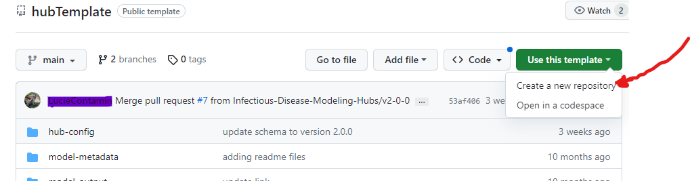
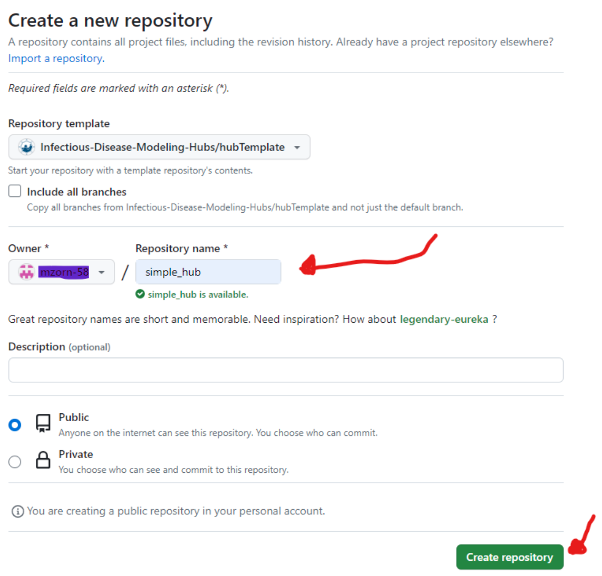
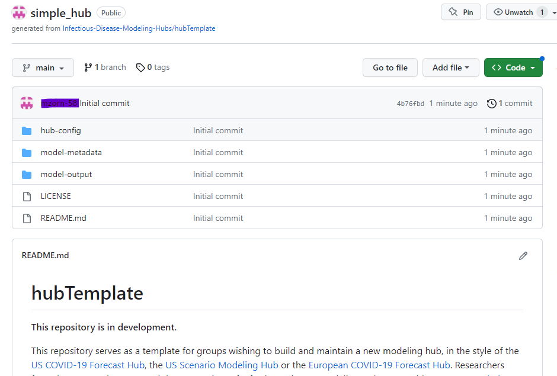

# Getting started  

In order to host a modeling hub, you first have to decide where to host, store, and archive the data. We support [three data storage options](../overview/data-storage.md), but for this quickstart guide, we will focus on GitHub.  

## Step 1: Create or open your GitHub account  

If you already have a GitHub account, you can move on to the next step.  If you do not have a GitHub account, create one following [these instructions](https://docs.github.com/en/get-started/signing-up-for-github/signing-up-for-a-new-github-account) (a free account is fine).  

## Step 2: Make a copy of the GitHub template repository  

Go to [hubTemplate](https://github.com/Infectious-Disease-Modeling-Hubs/hubTemplate) and click on "Use this template". Select "Create a new repository".  

  

## Step 3: Name and create the repository  

Enter a name for your repository.  You can use any name.  Then click on "Create repository".  

  

This repository ("repo") will be saved on your GitHub account.  

  

## Step 4: Clone your repository  

Clone the repo to your computer so that you can work with it locally.  GitHub has directions [here](https://docs.github.com/en/repositories/creating-and-managing-repositories/cloning-a-repository).  

## Congratulations!  

You have just created your first hub repository from the Hubverse. Read about the structure of hub repositories [here](../user-guide/hub-structure.md) and take some time to explore the repository on your computer.  
