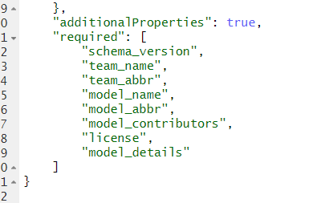

# Configuring model metadata

For each model that is submitted to the hub, a yaml metadata file ([what is a yaml file?](https://circleci.com/blog/what-is-yaml-a-beginner-s-guide/)) must be added to the `model-metadata` directory by the modeling teams. Details about the `model-metadata` directory can be found in the [model metadata chapter](../user-guide/model-metadata.md).

Many hubs will use a standard set of metadata fields. A hub's metadata fields are defined in the `model-metadata-schema.json`, which specifies the fields that will be required for each team that submits a model or forecast.

## Step 1: Open `model-metadata-schema.json`

Make sure you are in the `hub-config` folder. Then, click on `model-metadata-schema.json` to open the file.

```{image} ../images/model-metadata-schema-json.png
:alt: Screenshot of how to open model-metadata-schema.json file in RStudio
:class: bordered
```

## Step 2: Examine the `model-metadata-schema.json` file

You should see the code below in your source panel (upper right-hand panel).

```{image} ../images/model-metadata-schema-0.png
:alt: Screenshot of the code in the model-metadata-schema.json file
:class: bordered
```

If you scroll to the bottom of the file, you can see that the required fields for this schema are listed. Many hubs will use this list of metadata fields, but [additional fields are available](../user-guide/model-metadata.md).



The schema defines the properties of each metadata field. Below is the code defining the properties of the fields `team_abbr`, `model_name`, `model_abbr`, and `model_version`.

```{image} ../images/model-metadata-schema-2.png
:alt: Fragment of code from model-metadata-schema.json
:class: bordered
```

