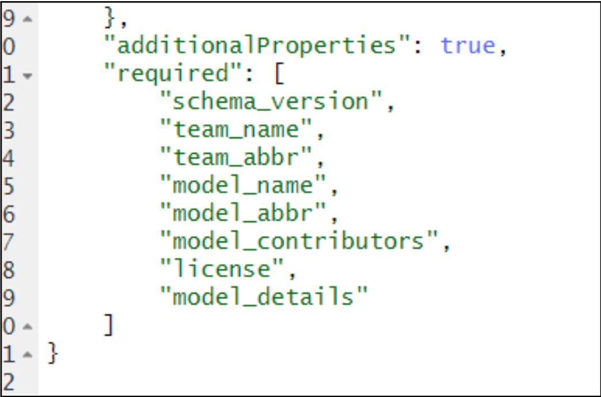

# Scripting Task Configuration  

The [`hubAdmin` package](https://hubverse-org.github.io/hubAdmin/index.html) provides tools to help with the configuration of tasks that are run on the hub. Specifically, the package has various [`create` functions](https://hubverse-org.github.io/hubAdmin/reference/index.html) that can be used to create objects that are used to build a `"tasks"` config file that can ultimately be written as a `tasks.json` file.  

In this section, we will walk through the process of scripting task configuration using functions from the `hubAdmin` package, in an order similar to that used in the [previous "Configuring tasks" section](#tasks-json-edits).  


Steps:
- Install the `hubAdmin` package
- Create src folder
- Create a new R script
- Load the `hubAdmin` package
- Follow steps here: https://hubverse-org.github.io/hubAdmin/reference/create_config.html 

## Step 1: Open `model-metadata-schema.json`  


## Step 1: Open `model-metadata-schema.json`  

Check to be sure you are in the `hub-config` folder. Click on `model-metadata-schema.json` to open the file.  

```{image} ../images/model-metadata-schema_json.png
:alt: Screenshot of how to open model-metadata-schema.json file in RStudio
:class: bordered
```

## Step 2: Examine the `model-metadata-schema.json` file  

In your source panel (upper right hand panel), you should see the code below.  

```{image} ../images/model-metadata-schema_0.png
:alt: Screenshot of the code in the model-metadata-schema.json file
:class: bordered
```

If you scroll to the bottom of the file, you can see that the required fields for this schema are listed. Many hubs will use this list of metadata fields, but there are additional fields available that are described [here](../user-guide/model-metadata.md).  

  

For each metadata field, the schema defines the properties of the field. Below is the code defining the properties of the fields `team_abbr`, `model_name`, `model_abbr`, and `model_version`.

```{image} ../images/model-metadata-schema_2.png
:alt: Fragment of code from model-metadata-schema.json
:class: bordered
```

