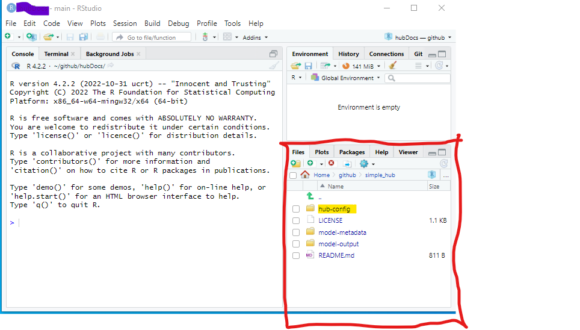
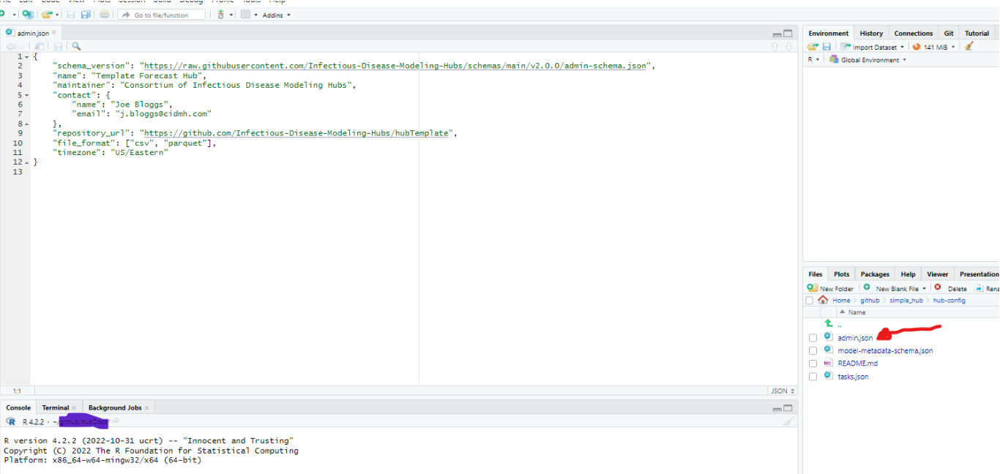
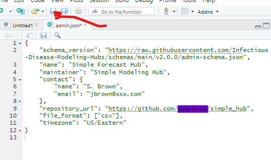

# Setting up a simple modeling hub  

Now we will go through the steps needed to set up and configure your modeling hub.  

## 1. Configuring your Modeling Hub  

The files within the `hub-config directory` specify general configurations for a hub as well as (possibly round-specific) details of what model outputs are requested or required. Details about these files can be found [here](../user-guide/hub-config.md).  

In order to work with the code in your hub, it is helpful to use software built for this purpose. One option is [Anaconda](https://docs.anaconda.com/free/) which is available for Windows, macOS, and Linux. On the linked page, you will find documentation explaining how to install and use it. You are also welcome to use any other software that is compatible.  

In our example, we will be using RStudio to work with the code. If you choose to use RStudio, you will need to have R and Rstudio loaded on your computer. Here are directions for downloading  [R](https://cran.rstudio.com/) and [RStudio](https://posit.co/download/rstudio-desktop/). You can also choose to use [Anaconda Navigator](https://docs.anaconda.com/free/navigator/) to download RStudio.  

In this example, we will be setting up a simple forecast hub in the style of the [Simple Forecast Hub Example](https://github.com/Infectious-Disease-Modeling-Hubs/example-simple-forecast-hub), which is adapted from forecasts submitted to [the US COVID-19 Forecast Hub](https://github.com/reichlab/covid19-forecast-hub), but has been modified to provide examples of nowcasts.  

## 2. Hub administrative configuration  

The first file that we will be working with is [`admin.json`](#hub_admin_config). This is the administrative hub configuration file containing generic information about the hub, as well as static configuration settings for downstream tools such as validations, visualizations, etc. **These global administrative settings are expected to remain fixed throughout a hub's existence and apply to all the modeling rounds for a hub.**  

### Step 1: Find the repository in RStudio  

Open RStudio and go to where your repo is stored on your local computer, using the Files pane.  

  

### Step 2: Open `admin.json`  

Click on the `hub-config` folder and open `admin.json` by clicking on it. It will appear in the upper left hand pane, which is called the 'source pane'.  

  

### Step 3: Examine the file  

You can find a description of each line of code in the  `admin.json` file [here](#hub_admin_config). In the example presented below, you can check the following details:  
- The maintainer is: "Simple Modeling Hub"  
- The contact person is: S Brown (sbrown@xxx.com)  
- The file format for submissions is" "csv"  
  
The code can be edited directly on the 'source pane' and saved by clicking on the disk icon indicated by the red arrow below.  

  

## Congratulations!  

You are ready to [configure the modeling tasks](tasks-config.md) for your modeling hub.  

