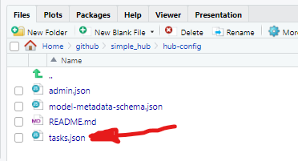
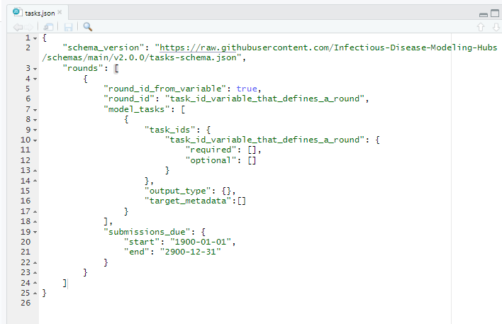
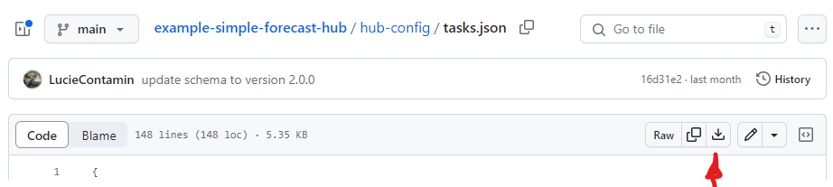
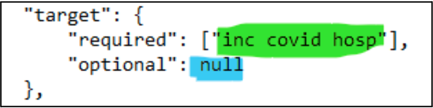
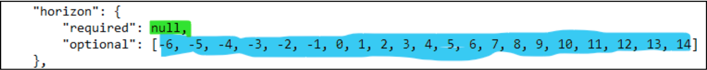
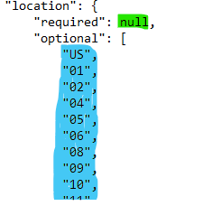
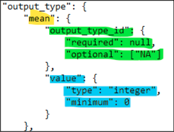
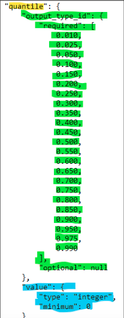
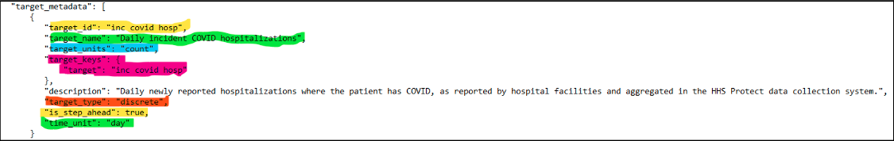
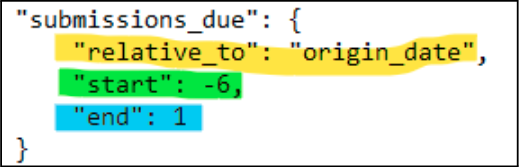

# Configuring tasks  

Every Hub is organized around "modeling tasks" that are defined to meet the needs of a project. Modeling tasks are defined for a hub in the [`tasks.json`](#model_tasks_schema) file, which specifies the model tasks (task ids and targets) as well as model output types. A detailed definition of modeling tasks can be found [here](../user-guide/tasks.md).  

## Step 1: Open `tasks.json`  

Check to be sure you are in  the `hub-config` folder. Click on `tasks.json` to open the file.  

  

## Step 2: Examine the `tasks.json` file  

In your source panel (upper left hand panel), you should see the code below. A description of each line of code in `tasks.json` can be found [here](#model_tasks_schema).  

  

This `tasks.json` file serves as a template, and has very few values filled out, which gives the user flexibility to adapt the Hub to their own needs. Nevertheless, in order to learn how to properly use this schema, we will use a "premade" `tasks.json` file from the [Simple Forecast Hub Example](https://github.com/Infectious-Disease-Modeling-Hubs/example-simple-forecast-hub) that already has values filled in, which will better illustrate what should go in each section.  

## Step 3: Close the `tasks.json` file in RStudio  

Make sure the `tasks.json` file in RStudio is closed, by clicking on the 'x' icon, as indicated below.  

  

## Step 4: Download a premade `tasks.json` file  

Download the `tasks.json` file from the Simple Forecast Hub Example by going [here](https://github.com/Infectious-Disease-Modeling-Hubs/example-simple-forecast-hub/blob/main/hub-config/tasks.json) and clicking on the *Download Raw File* icon as indicated below.  

  

Save the file in the `hub-cofig` folder (which is [in your repository on your local computer](#clone_repo)). This new file should replace the existing `tasks.json` file that was in this folder.  

## Step 5: Examine the new `tasks.json` file  

Open `tasks.json` and explore the content and structure. Some key concepts are defined [here](../overview/definitions.md), and additional explanations are offered below:  

* `schema_version`: Modeling Hub [Schema](../overview/definitions.md) versions are all housed in [this repository](https://github.com/Infectious-Disease-Modeling-Hubs/schemas/).  
* `round_id`: The [round](../overview/definitions.md) identifier establishes which date from a forecast submission is used to identify the submission round it corresponds to (e.g., the origin date).  
* `model_tasks`: Model [tasks](../overview/definitions.md) include all the goals of the modeling effort, including the `task_ids`, `output_type`, and `target_metadata`.
* `task_ids`: The [task](../overview/definitions.md) identifiers set the optional and required elements that go into a forecast submission, such as the `target`, `horizon`, `location`, and `origin date`.  
* `origin_date`: The date when a forecast was generated. More information on this and other dates, including how to use the `origin_date` to calculate the `target_date` can be found [here](../user-guide/tasks.md#usage-of-task-id-variables).  
* `horizon`: Sets the time range for which forecast predictions are to be made. For instance, these can be days into the future, or even days into the past, as in [nowcasts](../overview/definitions.md).  
* `location`: The geographic identifier, such as country codes or FIPS state/county level codes.  
* `output_type`: A [Model output](../overview/definitions.md) type establishes the valid model output types such as the mean, or specific quantiles. A more detailed explanation of model outputs can be found [here](../user-guide/model-output.md#formats-of-model-output).  

Now, read below for details on some of the lines of code in this file:  

### 5.1. Establishing the `"round_id"` and `"origin_date"` *(starting point)*:  
- <mark style="background-color: #32E331">The code highlighted in green</mark> establishes that the *round identifier* is encoded by a *task id* variable in the data.  
- <mark style="background-color: #38C7ED">The code highlighted in light blue</mark> sets the *round identifier* as `"origin_date"`.
- `task_ids` includes the variables `origin_date`, `target`, `horizon`, and `location`.  
- <mark style="background-color: #FFE331">The first variable, `origin_date` is highlighted in yellow</mark> and states that no *origin dates* are required, and that there are three valid, possible dates (`"2022-11-28", "2022-12-05", "2022-12-12"`). To be clear, no specific `origin_date` is required because every submission will have a different `origin_date` as each submission corresponds to a different forecasting time period (compare this with `location`, where some specific locations may be required for every submission.  

  

### 5.2. Setting the `"target"`:  
- <mark style="background-color: #32E331">The second line</mark> states that `"inc covid hosp"` is the required target. Additional required targets could be added here.  
- <mark style="background-color: #38C7ED">The third line</mark> states that there are no other optional targets that are valid. You could add `["cum covid hosp"]` if you wanted to allow that target, but not require it.  

  

### 5.3. Setting up the `"horizon"`:  
- The `horizon` refers to the difference between the `target_date` and the `origin_date` in time units specified by the hub (these could be days, weeks, or months).  
- <mark style="background-color: #32E331">The second line</mark> indicates that no horizons are required.  
- <mark style="background-color: #38C7ED">The third line</mark> states that the forecast can be for up to 6 days **before** the `origin_date`, and up to 14 days **after** the `origin_date`.  

  

### 5.4. Establishing the `"location"`:  
- The `location` refers to the geographic identifier, such as country codes or FIPS state/county level codes.  
- <mark style="background-color: #32E331">The second line</mark> states that no particular location is required, although in some instances, certain locations might be required for all submissions.  
- <mark style="background-color: #38C7ED">The third line</mark> indicates the locations that may be submitted. In this example, they are FIPS codes for US states and territories.  

  

### 5.5. Defining [`"output_type"`](../user-guide/model-output.md#formats-of-model-output):  
- The [`output_type`](../user-guide/model-output.md#formats-of-model-output) is used to establish the valid model output types for a given modeling task. In this example they include `mean` and `quantile`.  

#### 5.5.1. Setting the `"mean"`:  
- <mark style="background-color: #FFE331">Here, the `"mean"` of the predictive distribution</mark> is set as a valid value for a submission file.  
- <mark style="background-color: #32E331">`"output_type_id"` is used</mark> to determine whether the `mean` is a required or an optional `output_type`. In this example, the mean is optional, not required.  
- <mark style="background-color: #38C7ED">`"value"` sets the characteristics</mark> of this valid `output_type` (i.e., the mean). In this instance, the value must be an `integer` greater than or equal to `0`.  

  

#### 5.5.2. Setting up `"quantile"`:  
- <mark style="background-color: #FFE331">Here, `quantile` specifies</mark> what quantiles of the predictive distribution are valid values for a submission file.  
- <mark style="background-color: #32E331">In this case, `"output_type_id"` establishes</mark> that this is a required `output_type`, and it sets the accepted probability levels at which quantiles of the predictive distribution will be recorded. In this case, quantiles are required at discrete levels that range from `0.010` to `0.990`.  
- <mark style="background-color: #38C7ED">As before, `"value"` sets the characteristics</mark> of valid `quantile` values. In this instance, the values must be integers greater than or equal to `0`.  

  

### 5.6. Instituting `"target_metadata"`:  
- `"target_metadata"` defines the characteristics of each unique `target`.  
- <mark style="background-color: #FFE331">To begin with, `"target_id"` is</mark> a short description that uniquely identifies the target.  
- <mark style="background-color: #32E331">Similarly, `"target_name"` provides</mark> a longer, human readable description of the target.  
- <mark style="background-color: #38C7ED">`"target_units"` indicates</mark> the unit of observation used for this target.  In this instance, the unit is count.  
- <mark style="background-color: #F50088">`"target_keys"` must match</mark> a target set in `task_ids`, to appropriately identify it.  In this instance, the target is `"inc covid hosp"`.  
- The `"description"` is a verbose explanation of the target, which might include details on the measure used for the target, as shown in the example below.  
- <mark style="background-color: #FF4D18">The `"target_type"` defines</mark> the target's statistical data type. In this instance, the target uses discrete data.  
- <mark style="background-color: #FFE331">`"is_step_ahead"` indicates</mark> whether the target is part of a sequence of values.  In this instance, it is.  
- <mark style="background-color: #32E331">`"time_unit"` defines</mark> the units of the time steps. In this case, it is days.  

  

### 5.7. Setting up `"submissions_due"`:  
- `"submissions_due"` establishes the dates by which model forecasts must be submitted to the hub. It is used by `hubValidations` when validating submission files.  
- <mark style="background-color: #FFE331">`relative_to` specifies</mark> the *task id* variable in relation to which submission start and end dates are calculated.  In this instance it is `"origin_date"`.  
- <mark style="background-color: #32E331">`"start"` is a number</mark> used to calculate the beginning of the submission period, based on the `origin_date`. In this example, the start date is six days **prior** to `origin_date`.  
- <mark style="background-color: #38C7ED">On the other hand, `"end"` is a number</mark> used to calculate when the submission period is finished, based on the `origin_date`. In this example, the end date is one day **after** `origin_date`.
- For instance, as was mentioned before, in this file, `2022-11-28` is allowed as an `origin_date`. In this case, submissions are due between "2022-11-22" (six days prior) and "2022-11-29" (one day after).  

  

