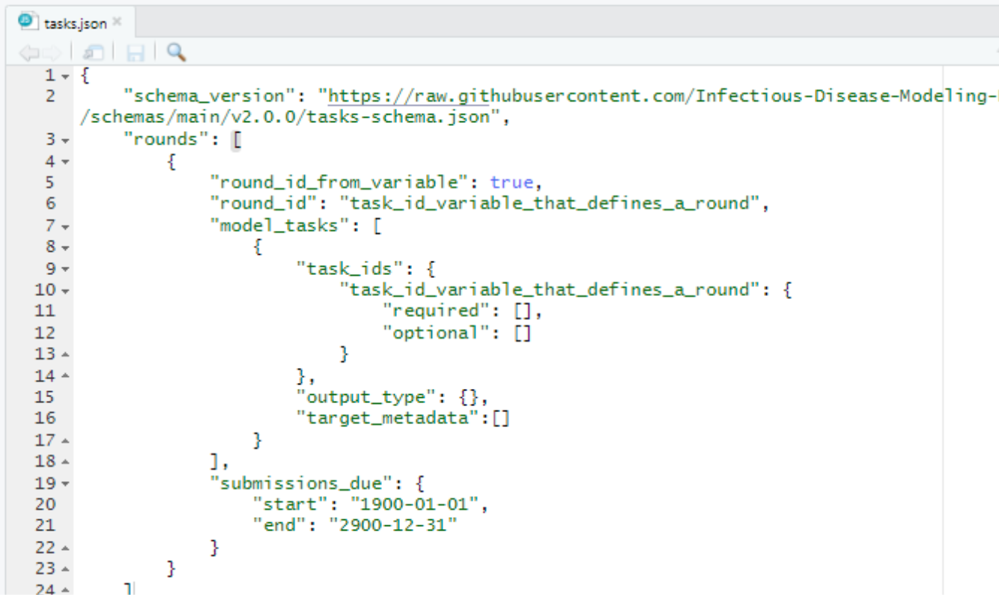

# Hub model tasks configuration  

Every Hub is organized around "modeling tasks" that are defined to meet the needs of a project. Modeling tasks are defined for a hub in the [`tasks.json`](../user-guide/hub-config.md#model-tasks-tasks-json-interactive-schema) file, which specifies the model tasks (task ids and targets) as well as model output types. A detailed definition of modeling tasks can be found [here](../user-guide/tasks.md).  

## Step 1: Open `tasks.json`  

Check to be sure you are in  the `hub-config` folder. Click on `tasks.json` to open the file.  

  

## Step 2: Examine the file  

In your source panel (upper left hand panel), you should see the code below. A description of each line of code in `tasks.json` can be found [here](../user-guide/hub-config.md#model-tasks-tasks-json-interactive-schema).  

  

## Step 3...  
