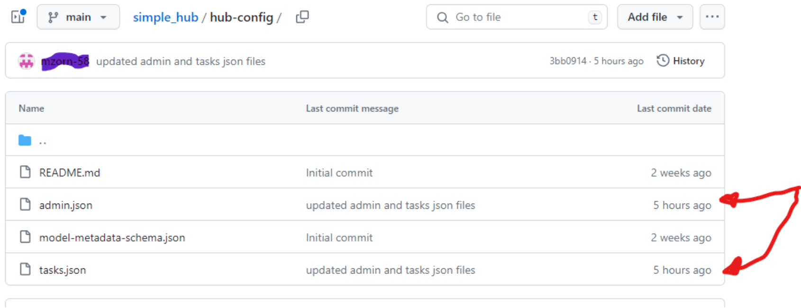
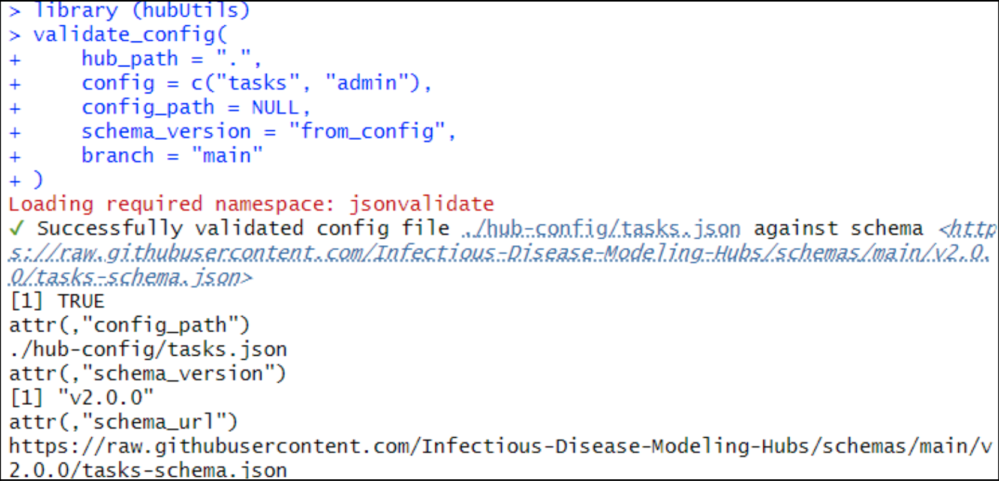
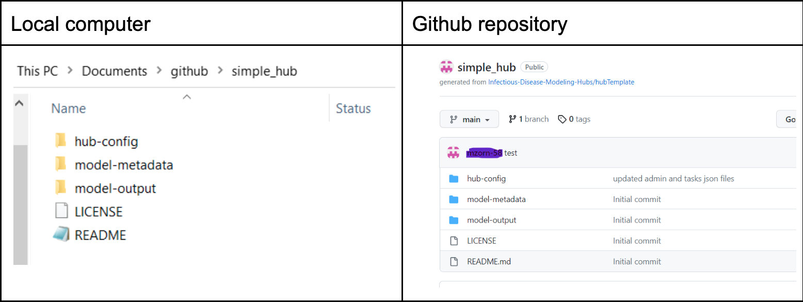

# Uploading and validating config files  

You have now made all the changes necessary to start using the simple hub, but the changes to `admin.json` and `tasks.json` are only on your local computer. You want to move them to your GitHub repository.

## Uploading changes from your local computer to GitHub  

Follow GitHub directions [here](https://docs.github.com/en/repositories/working-with-files/managing-files/adding-a-file-to-a-repository) for adding files to a repository.  

Once you have uploaded those two files onto your GitHub repository, you will notice that they have been updated by looking at the last commit date, as indicated below.  

  

## Validating your config files  

Now you should validate the config files, to be sure they are properly functional. You can use the `validate_config` function from [`hubUtils`](https://infectious-disease-modeling-hubs.github.io/hubUtils/index.html) to check whether Hub config files are valid. The steps are as follows:  

1. First, you need to install the package `hubUtils`. Instructions for installing it are found [here](https://github.com/Infectious-Disease-Modeling-Hubs/hubUtils#installation).  
2. Next, you can validate the config files by following [these instructions](https://infectious-disease-modeling-hubs.github.io/hubUtils/articles/hub-setup.html#validate-config-files).  

Below is an example using the simple hub. You can see that the config files were successfully validated.  

  

## Congratulations!  

Your simple hub repository is now ready to be used! You created a simple hub and modified the `config.json` and `task.json` files. You now have:  
- [x] Created a hub repository
- [x] Cloned the hub repository to your local computer
- [x] Configured the modeling hub by: 
  - [x] Modifying `admin.json`
  - [x] Modifying `tasks.json`
- [x] Uploaded modified files from your local computer to GitHub
- [x] Validated config files

  

Next, it is time to start using your modeling hub.  

