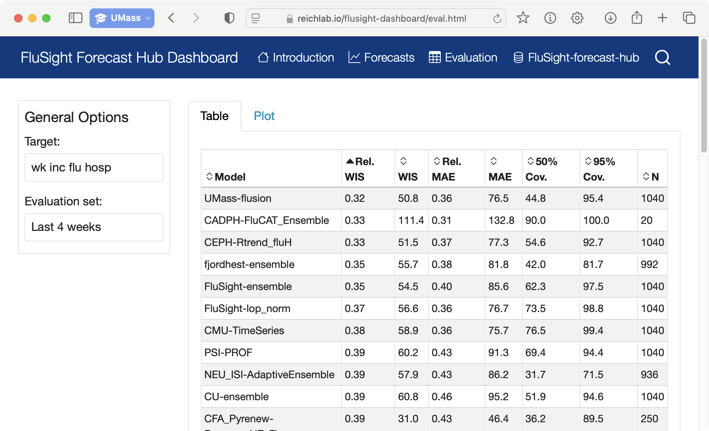

# Dashboards

The hubverse provides a modular system for building a dashboard website for a modeling hub. This includes three main components:

1. A system for creating a website with multiple pages by creating a set of markdown files with site contents and a yaml file specifying configuration settings. This is based on the [quarto publishing system](https://quarto.org/).
2. An optional module for interactive visualizations of model outputs (predictions) and target data.
3. An optional module for interactive exploration of scores for model predictions.

````{subfigure} AB|CD
:gap: 1%
:class: margin-caption
:class-area: bordered





A dashboard provides interactive visualizations for forecasts and evaluations derived from hub data. This provides information modelers can use to evaluate and compare their submissions.
````

The website contents, including the web pages as well the data backing interactive visualizations and evaluations, are built by GitHub actions that can be set to run on a regular schedule or manually as needed. By default, the website is hosted on a GitHub pages site, though it could also be hosted on another static website hosting platform if desired.
This guide assumes three things about the reader:
1. you know how to edit and write files with [pandoc-flavored Markdown](https://pandoc.org/MANUAL#pandocs-markdown),
2. you know how to edit and write [YAML files](https://en.wikipedia.org/wiki/YAML)
3. you are comfortable setting up a [GitHub workflow](https://docs.github.com/en/actions/writing-workflows/quickstart) with a scheduled job.

Below, we describe how to set up each of these three components of the dashboard system and the use of GitHub actions for building the site.


:::{note}

The current iteration of the dashboard is intended for modelers and hub administrators, who are more likely to be familiar with modeling exercise and evaluation methods.

This is not yet intended for use by decision-makers as there is more information here than they may want or need.

:::

(dashboard-quickstart)=
## Quickstart -- building a dashboard

The Hubverse provides a [template dashboard repository](https://github.com/hubverse-org/hub-dashboard-template) to facilitate the process of setting up a dashboard for a modeling hub. Use this template to create a dashboard repository for your hub by clicking the "Use this template" button near the top right of the GitHub page for the template:

```{figure} ../images/hub-dashboard-template-use-template.png
---
figclass: margin-caption
alt: A screenshot of the GitHub repository for the hub dashboard template. There is a red circle around the "Use this template" button.
name: hub-dashboard-template-use-template
---
Creating a hub dashboard from the template.
```

Then do the following to customize your dashboard (see the sections below for more detail):

1. Add markdown content to `pages/`
2. Update `site-config.yml`
    1. `hub` is the github slug for your active hub. This example defaults to the CDC FluSight hub
    2. `title` is the title of your dashboard
    3. `pages` is an optional list of pages you want included in the top bar. These will be shown after the home page (index.html) and the visualization and evaluation pages if they are included (see the next points). These pages can be used for details of methodology, team members, or anything that can be written in Markdown (see next section).
3. Update `predtimechart-config.yml` to specify forecast visualization configuration settings for your hub. If you do not need a forecast visualization, delete this file.
4. Update `predevals-config.yml` to specify evaluation page configuration settings for your hub. If you do not need an evaluation page, delete this file.
5. If necessary, update the `.github/workflows/build-data.yml` to change the timing of scheduled data builds. All timing is in UTC. You can use https://crontab.guru to specify the schedule.

Once these steps are performed, the workflows will automatically generate the website on the `gh-pages` branch on your behalf. Once this branch is created, you can activate your website to deploy from this branch.

:::{admonition} Setting up GitHub pages
:class: note

At the moment, the first time you create your repository, to set up hosting of
your dashboard on GitHub pages, you will need to manually switch on GitHub
pages by going to `<repo>/settings/pages` and selecting `gh-pages` as the branch
to deploy from:


:::

(dashboard-customization)=
## Customizing the dashboard website

### Page organization and content

Each individual page within the dashboard is defined by a corresponding markdown file located within the `pages` folder of the dashboard repository. These files use the [Pandoc markdown syntax](https://quarto.org/docs/authoring/markdown-basics.html) to specify page contents. By default, the dashboard template comes with a landing page (defined in `index.qmd`) and an "about" page (defined in `about.qmd`). The file extension `.qmd` indicates that these will be used with Quarto. Additional pages can also be added to the dashboard by creating more Quarto markdown files. To be findable by dashboard users, these additional pages must either be added to the main navigation menu for the dashboard (see the next section for how to do this), or linked to from another page.

### Configuration

The `site-config.yml` is a simplified form of [A Quarto Website](https://quarto.org/docs/websites/#config-file). This simplified form is intended to allow you to set up a dashboard website in a matter of minutes while allowing for flexibility of theme.

A simple configuration is presented in [the template `site-config.yml`](https://github.com/hubverse-org/hub-dashboard-template/blob/HEAD/site-config.yml) file
with three keys:

 - hub: the GitHub slug to your active hub that contains quantile forecast data
 - title: the title of your hub dashboard website
 - pages: a [YAML array](https://www.commonwl.org/user_guide/topics/yaml-guide.html#arrays) that lists files _relative to [the `pages` directory](https://github.com/hubverse-org/hub-dashboard-template/tree/HEAD/pages/)_ that should be included in the dashboard site. The name of each page is encoded in the `title:` element of the file header (but this can be overridden with [site customization](#dashboard-site-customization)).

Other than the `hub` field all remaining fields have the following mapping equivalents in the Quarto configuration file:

| `site-config.yml`  | `_quarto.yml` |
| :------------------ | :------------- |
| `.title`           | `.website.title` |
| `.pages`           | [`.website.navbar.left`](https://quarto.org/docs/websites/website-navigation.html#top-navigation) |
| `.html` (optional) | [`.format.html`](https://quarto.org/docs/reference/formats/html.html#format-options) |

(dashboard-site-customization)=
### Customization

When the page is built with [the hub dashboard site builder](https://github.com/hubverse-org/hub-dash-site-builder), this configuration file is merged with [the default quarto config file](https://github.com/hubverse-org/hub-dash-site-builder/blob/HEAD/static/_quarto.yml). This allows for customization of the page. Below
are examples of customization.

#### Icons added to pages

You can add icons to the page title bars with a YAML map. If you wanted to add an icon of people for the "about" page, you would use `.pages.icon: "people-fill"`.

```yaml
pages:
  - icon: "people-fill"
    href: "about.md"
  - icon: "mortarboard-fill"
    href: "citation.md"
```

The full list of available icons can be found on the [Bootstrap icons website](https://icons.getbootstrap.com/).

#### Theme

The default site is built on top of the [Bootstrap yeti theme](https://bootswatch.com/yeti/) with [custom CSS](https://github.com/hubverse-org/hub-dash-site-builder/blob/HEAD/static/resources/css/styles.css).

If you wanted to use [a different theme](https://quarto.org/docs/output-formats/html-themes.html), you can change it by setting `.html.theme`. You can reset the css by setting `.html.css: null`

```yaml
html:
  theme: "litera"
  css: null
```

#### Contents

If you wanted to add custom HTML to appear at the bottom or top of every page,
you can use `.html.include-after-body` or `.html.include-before-body`. Remember
that all resources are _relative to the `pages/` directory_, so if you wanted
to include an HTML snippet at the end of every page you would:

1. add a file called `resources/after-body.html` into `pages/`
2. add this to your yaml:
   ```yaml
   html:
     include-after-body: "resources/after-body.html"
   ```

(dashboard-ptc)=
## PredTimeChart visualization (optional)

The PredTimeChart visualization module creates an interactive display of step-ahead predictions, including scenario projections, hindcasts, nowcasts, and forecasts. Dashboard users can select different models to include, the reference date (also referred to as the origin date) when predictions were created, and the values of task id variables to show (such as location). The visualization shows predictions alongside the latest available target data and the version of the target that was available at the time the predictions were created.

```{figure} ../images/dashboard-viz-screenshot.png
---
figclass: margin-caption
alt: A screenshot of the visualization in the FluSight dashboard. The visualization shows predictions (median and 95% prediction intervals) of weekly incident influenza hospitalizations in the United States from two models.
name: dashboard-viz-screenshot
---
A screenshot of the visualization in the FluSight dashboard.
```

:::{important}

In order to make use of the visualization your hub needs to satisfy these requirements:

- have a target with quantile outputs that define the predictive median and the bounds of 50% and 95% prediction intervals.
- have rounds defined by a variable.
- have step-ahead predictions with columns defining the horizon, and reference and target dates.
- target data must use the [Hubverse conventions for target time series data](../user-guide/target-data.md)

For details, see the [limitations and requirements section](#ptc-limitations) below.
:::

(dashboard-ptc-config)=
### Configuring the PredTimeChart visualization module


To include the PredTimeChart visualization[^ptc-nope], edit the `predtimechart-config.yml` file to match your hub. You can view the [raw schema](https://raw.githubusercontent.com/hubverse-org/hub-dashboard-predtimechart/main/src/hub_predtimechart/ptc_schema.py) for this file to see the detailed specification of its contents. Below, we give an example file based on the [FluSight forecast hub](https://github.com/cdcepi/FluSight-forecast-hub) and describe the fields to include:

[^ptc-nope]: If you do not want to include a visualization using the PredTimeChart module in your dashboard, delete the `predtimechart-config.yml` file from your dashboard repository.

```yaml
---
rounds_idx: 0
model_tasks_idx: 1
reference_date_col_name: 'reference_date'
target_date_col_name: 'target_end_date'
horizon_col_name: 'horizon'
initial_checked_models: ['FluSight-ensemble', 'FluSight-baseline']
disclaimer: 'Be careful when interpreting these forecasts.'
task_id_text:
  location:
    "US": "United States"
    "01": "Alabama"
    "02": "Alaska"
    "04": "Arizona"
    "05": "Arkansas"
    "06": "California"
```

This file is written in the [YAML format](https://en.wikipedia.org/wiki/YAML), and it contains the following fields:

 - `rounds_idx`: The 0-based index of the `rounds` entry in the hub's `tasks.json` configuration file to use for the visualization (limited to a single [round block defined from a variable](#ptc-limitation-rounds)).
 - `model_tasks_idx`: The 0-based index of [a single `model_tasks` entry](#ptc-limitation-mt) under `rounds_idx` to use for the visualization.
 - `reference_date_col_name`: The name of the column that represents the reference date (sometimes also referred to as the origin date) for step-ahead predictions.
 - `target_date_col_name`: The name of the column that represents the target date for a step-ahead prediction.
 - `horizon_col_name`: The name of the column that represents the forecast horizon for a step-ahead prediction.
 - `initial_checked_models`: An array of model ids that should be displayed when the visualization is first loaded.
 - `disclaimer` (**optional**): Text that is displayed immediately above the visualization to provide important information to dashboard users.
 - `task_id_text` (**optional**): A mapping of values for task id variables to text that is displayed in the visualization. In the example above, this is be used to replace numeric location codes with location names. Each task id variable with a value-to-text mapping should be listed as a property under `task_id_text`.
 In the example above, the `"location"` task ID lists the FIPS codes for US states and territories. The value-to-text mapping `"01": "Alabama"` shows that the variable `"01"` corresponds to `"Alabama"`.

(ptc-limitations)=
### PredTimeChart limitations and requirements

Here we summarize some important limitations of the visualization functionality that is currently available:

 - The visualization tool can only display step-ahead predictions that use the quantile output type.
 - It can only display predictions for tasks that are defined in [a single entry in the `rounds` section of the hub's `tasks.json` configuration file]{#ptc-limitation-rounds}. Note that it is possible to display predictions for multiple rounds, and a dashboard typically will do that. However, those rounds must be defined in a single `rounds` block.
 - It can only display predictions for modeling tasks that are defined in [a single entry of the `model_tasks` section of the hub's `tasks.json` configuration file.]{#ptc-limitation-mt} Again, this allows for display of predictions across multiple modeling tasks as long as the values of the task id variables defining those modeling tasks are specified in the same `model_tasks` block.
 - Currently, only a single prediction target is supported. Specifically, the `target_metadata` array in the specified `model_tasks` object within the specified `rounds` object must contain exactly one object, which must have a single key in the `target_keys` object.
 - The following quantile levels (`output_type_id`s) must be present: `0.025`, `0.25`, `0.5`, `0.75`, `0.975`. These quantiles define the predictive median and the bounds of 50% and 95% prediction intervals.
 - The hub must have task id variables defining:
    - A reference date for predictions (e.g., `reference_date`, `origin_date`, or similar)
    - The target date of a predicted event (e.g., `target_date`, `target_end_date`, or similar)
    - The forecast horizon, defined as the difference between the target date and the reference date (e.g. `horizon` or similar)
 - Model metadata must contain a boolean `designated_model` field. The visualization only includes models where this field has been set to `true`.
 - As was noted above, the target time series data must be stored in the hub using the [Hubverse conventions for target time series data](../user-guide/target-data.md). Additionally, at this time only a single `.csv` file with time series data is supported (i.e., this module currently does not support the `parquet` format or hive partitioned data).
    - The date column in the target time series data must have the same name as the "target date" column in the model output file, and this must be specified in the `target_date_col_name` field in the `predtimechart-config.yml` file.
 - When assembling versions of the time series target data, it is assumed that the reference date is the Saturday after the date when the data build action is running. Additionally, it is assumed that the `as_of` date to use for data versioning is the reference date (i.e., there are no intermediate data releases between the time of forecast submission and the reference date).

If you are interested in using the PredTimeChart tool for a visualization but your use case doesn't satisfy these requirements, get in touch! We may be able to make updates to support your hub.

(dashboard-predevals-eval)=
## PredEvals evaluation (optional)

The PredEvals module creates an interactive display of scores for predictions. Dashboard users can view overall scores in a table, or see heatmaps or line plots visualizing scores broken down by a task id variable.

````{subfigure} A|B|C
:gap: 0.5%
:class: margin-caption
:class-area: bordered


The evaluation dashboard has a sortable table and two visualizations, a line plot and heatmap, that are disaggregated by task ID
````

:::{important}

In order to make use of the evaluations tool, your hub needs to satisfy these requirements:

 - Your hub uses `mean`, `median`, `quantile`, and `pmf` output types.
 - Your hub's `tasks.json` has a single `round` element with `round_id_from_variable: true`.
 - Your hub has oracle output data available in the [Hubverse Oracle Output format](#oracle-intro-example)


For details, see the [limitations and requirements section](#predevals-limitations) below.
:::

(dashboard-predevals-config)=
### Configuring the PredEvals module


To include the PredEvals component[^predevals-nope], edit the `predevals-config.yml` file to match your hub. Broadly, you need to specify four things:

1. schema version
2. targets: one or more targets that includes
   - target ID
   - scoring metrics (see the [details for `hubEvals::score_model_out()`](https://hubverse-org.github.io/hubEvals/reference/score_model_out.html#details) for a list of available metrics and [Scoring rules in `scoringutils`](https://epiforecasts.io/scoringutils/articles/scoring-rules.html) for a detailed breakdown of how these metrics are scored).
   - what metrics should include relative scores compared to a baseline model
   - task IDs required for the target
3. evaluation sets that provide evaluations over a specific time period and broken down by different task ID variables.
4. a dictionary that defines human-readable values for task ID variable values.


Here, we give an example configuration file that is adapted from the [FluSight forecast hub](https://github.com/cdcepi/FluSight-forecast-hub)[^predevals-trim].
In this example, we specify that scores should be computed for a single target, `"wk inc flu hosp"`. We specify four metrics to compute: the weighted interval score (WIS), absolute error of the median, and prediction interval coverage at the 50% and 95% levels. Relative skill will be computed for two of those metrics: WIS and absolute error. In relative skill computations, scores will be normalized relative to the `FluSight-baseline` model. Finally, the evaluations will include overall scores for each model in the table, as well as the option to plot scores broken down by the `location`, `reference_date`, `horizon`, and `target_end_date` task id variables (breaking scores down by one variable at a time).

:::{important}
It is generally recommended that the baseline model used for relative skill scores has provided predictions for all modeling tasks that are predicted by any other models.
:::


[^predevals-nope]: If you don't want to include an evaluation page using the PredEvals module in your dashboard, delete the `predevals-config.yml` file from your dashboard repository.
[^predevals-trim]: In order to preserve space on this page, we only show 5 locations in this config file. You can find the [full configuration file](https://github.com/reichlab/flusight-dashboard/blob/34bb90f11aa42ac5c27216d733b05c40f6ab0ead/predevals-config.yml) in the reichlab/flusight-dashboard repository.


```yaml
schema_version: https://raw.githubusercontent.com/hubverse-org/hubPredEvalsData/main/inst/schema/v1.0.0/config_schema.json
targets:
- target_id: wk inc flu hosp
  metrics:
  - wis
  - ae_median
  - interval_coverage_50
  - interval_coverage_95
  relative_metrics:
  - wis
  - ae_median
  baseline: FluSight-baseline
  disaggregate_by:
  - location
  - reference_date
  - horizon
  - target_end_date
eval_sets:
- eval_set_name: Full season
  round_filters:
    min: '2024-11-30'
  task_filters:
    location:
    - "01"
    - "02"
    - "04"
    - "05"
    - "06"
    ...
    horizon:
    - 0
    - 1
    - 2
    - 3
- eval_set_name: Last 4 weeks
  round_filters:
    min: '2024-11-30'
    n_last: 5
  task_filters:
    location:
    - "01"
    - "02"
    - "04"
    - "05"
    - "06"
    ...
    horizon:
    - 0
    - 1
    - 2
    - 3
task_id_text:
  location:
    '01': Alabama
    '02': Alaska
    '04': Arizona
    '05': Arkansas
    '06': California
    ...
```

This file is written in the [YAML format](https://en.wikipedia.org/wiki/YAML). You can view the [raw schema](https://raw.githubusercontent.com/hubverse-org/hubPredEvalsData/main/inst/schema/v1.0.0/config_schema.json) for this file to see the detailed specification of its contents, or use the widget below to explore the schema interactively:


<script src="../_static/docson/widget.js" data-schema="https://raw.githubusercontent.com/hubverse-org/hubPredEvalsData/main/inst/schema/v1.0.0/config_schema.json"></script>


Unlike the PredTimeChart module, PredEvals supports scoring for multiple targets. We could specify another target for evaluation by adding an entry for it at the same level as the `"wk inc flu hosp"` target, complete with specifications for the `target_id`, the `metrics` and `relative_metrics` to compute, the `baseline` to use for relative metrics (if applicable), and the task id variables to `disaggregate_by` for that target.

The example specifies two evaluation sets, named `"Full season"` and `"Last 4 weeks"`. In the evaluation dashboard, a dropdown menu allows users to select the evaluation set for which results are displayed. Both evaluation sets are specified using a combination of filters on the modeling round (`round_filters`) and other filters on the modeling tasks (`task_filters`). Two types of `round_filters` are available. Both evaluation sets use the `min` setting to specify the earliest round id that is included in the evaluation set. The value of this setting must be a valid value of the task id variable that is used for the `round_id_from_variable` in the hub's `tasks.json` configuration file. The `"Last 4 weeks"` evaluation set additionally specifies `n_last`, which gives the trailing number of modeling rounds to include in the evaluation set.

:::{admonition} More detail about the `n_last` setting
:class: note

In the example above, the `"Last 4 weeks"` evaluation set uses the setting `n_last: 5`, which is admittedly confusing! The correct value to use here depends on details of scheduling for when scores are calculated after a round closing relative to when modelers submit predictions.

The `n_last` setting specifies the number of modeling rounds with any available model output data that should be included in the evaluation set. In this case, the last 5 modeling rounds with any available model output data are included in the evaluation set.  However, for the FluSight dashboard, scores are calculated and the dashboard is updated the day after the data release occurs and model submissions are due. This means that at the time the scores are calculated, model predictions are available for a round that just closed and for which no observed data are available yet to use in score computations. Since the predictions from that final round can't be scored, they are effectively discarded and in practice only the previous 4 rounds are included in the evaluation set. If it was possible to schedule the evaluations to run after a given data release but before any model predictions for the next round were submitted, we could set `n_last` to 4 instead of 5.

:::

In addition to `round_filters`, both of the evaluation sets in the example above use `task_filters`. In these examples, scores will be calculated for all state-level locations (discarding forecasts at the national level) and only for horizons 0 through 3 (discarding "hindcasts" made at horizon -1).

For each evaluation set, all filters are combined with "and" logic.  For example, the "Full season" evaluation set includes all predictions made in modeling rounds on or after `'2024-11-30'`, for state-level locations at non-negative forecast horizons.

:::{admonition} Redundancy of `round_filters` and `task_filters`
:class: note

In principle, it would be possible to implement `round_filters` by specifying the set of rounds to include within the `task_filters` block. While this is possible, specifying `round_filters` is more convenient and maintainable, so we recommend using those settings where appropriate.

:::

(predevals-limitations)=
### PredEvals limitations and requirements

The PredEvals module has several important limitations:

 - The evaluation tool only supports hubs that have a single entry in the `rounds` section of the `tasks.json` configuration file.
 - Only hubs with `round_id_from_variable` set to `true` in the `tasks.json` configuration file are supported.
 - Supported output types include `mean`, `median`, `quantile`, and `pmf`. However, support for ordinal pmf predictions is still experimental. The `sample` and `cdf` output types are not supported.

(dashboard-workflows)=
## Using GitHub actions to build site contents and data

The template dashboard repository comes with two GitHub workflows that are responsible for building the site contents and data. These are located in the `.github/workflows/` folder:

- `build-site.yml` is used to build the dashboard site contents every time a change happens on the `main` branch of the dashboard repository.
- `build-data.yml` runs weekly on Thursdays at 5:45PM UTC to update the underlying data for the dashboards. This schedule is configurable to work with your hub. Note that this does not run on every commit.

You can also [manually run](https://docs.github.com/en/actions/managing-workflow-runs-and-deployments/managing-workflow-runs/manually-running-a-workflow#running-a-workflow) either of these workflows if you need to rebuild your site or data.

If the above defaults looks good to you, then as long as you've enabled GitHub Actions, then there's nothing you need to do!

### Modifying the schedule of the data builds

The default schedule for data builds is set for later in the day on Thursdays to account for a hub that takes submissions on Wednesdays:

```{code-block} yaml
:emphasize-lines: 4
:lineno-start: 1
:caption: The schedule is defined by a CRON schedule statement
name: "Rebuild Data"
on:
  schedule:
    - cron: "33 17 * * 4" # every Thursday at 17:33 UTC == 12:33 EST
```

:::{tip}
You might notice that the schedule runs at an odd time and not at the hour or half hour. This is intentional to give your workflow a better chance at having an available compute node to work on.

This is because a lot of people have their workflows run at the top of the hour (especially midnight UTC). This creates a high load on GitHub's servers and that can cause your run to be dropped from the queue. From [GitHub's documentation on workflow schedules](https://docs.github.com/en/actions/writing-workflows/choosing-when-your-workflow-runs/events-that-trigger-workflows#schedule):

> The `schedule` event can be delayed during periods of high loads of GitHub Actions workflow runs. High load times include the start of every hour. If the load is sufficiently high enough, some queued jobs may be dropped. To decrease the chance of delay, schedule your workflow to run at a different time of the hour.

:::

If you want to change that schedule, you can use https://crontab.guru to find the code for a time that works for your hub. For example, if your hub has a weekly submission on Wednesday in US Pacific Time Zone, but ensembles take over a day to generate, then you might want the data to rebuild on [Friday mornings at 9:47 AM PDT](https://crontab.guru/#37_16_*_*_5), then you would modify line 4 of the workflow to read:


```{code-block} yaml
:lineno-start: 4
    - cron: "37 16 * * 5" # every Friday at 16:37 UTC == 09:37 PDT
```

### Manual interventions

If you find that your dashboard website is not building because GitHub actions
are down or your hub is private (and thus cannot access any data), there are
still ways to update your dashboard. Two options are presented below.

:::{admonition} Prerequisite knowledge

This section assumes you are comfortable with git branches and workflows on
GitHub.

:::

#### Understanding where each component lives

The publishing strategy behind the dashboard is that the website and data are
hosted on separate branches of the dashboard repository.

| component | source branch | build tool | GitHub workflow |
| :-------- | :------------ | :--------- | :-------------- |
| website   | `gh-pages`    | <https://github.com/hubverse-org/hub-dash-site-builder> | `build-site.yaml` |
| forecast data | `ptc/data`    | <https://github.com/reichlab/hub-dashboard-predtimechart> | `build-data.yaml` |
| evaluations data | `predevals/data`    | <https://github.com/reichlab/hubPredEvalsData-docker> | `build-data.yaml` |

In this strategy, `gh-pages` hosts the website, which is deployed to your
repository's GitHub Pages site. The `forecast.html` and `eval.html` pages of
your site will then dynamically fetch the data from the `ptc/data` and
`predevals/data` branches, respectively using GitHub's
`raw.githubusercontent.com` service. This allows the data to be updated without
needing an update to the website.

It is also possible to [build the site using data
locally](https://github.com/hubverse-org/hub-dash-site-builder?tab=readme-ov-file#rendering-with-local-data)
for offline use.

#### Option 1: Manually run a workflow

If something is awry, the first step is to check that the workflows are
operating correctly. You [manually
run](https://docs.github.com/en/actions/managing-workflow-runs-and-deployments/managing-workflow-runs/manually-running-a-workflow#running-a-workflow)
either of the workflows to check this. All workflows have the option to do a
dry run, which means that they will generate data, but they will not push it to
the branch. You can check for [workflow
artifacts](https://docs.github.com/en/actions/managing-workflow-runs-and-deployments/managing-workflow-runs/downloading-workflow-artifacts)
that contain the data generated if you want to inspect it by hand. If
everything seems fine, then you can publish.

For forecast data, you might encounter hiccups where you want to reset the
data. In this case, check the box that says **(Forecast) Regenerate
previously-recorded model output data?**

#### Option 2: Manually update the branches

If the workflows are not working, you can still update your site by building
locally and pushing to the correct branches.

